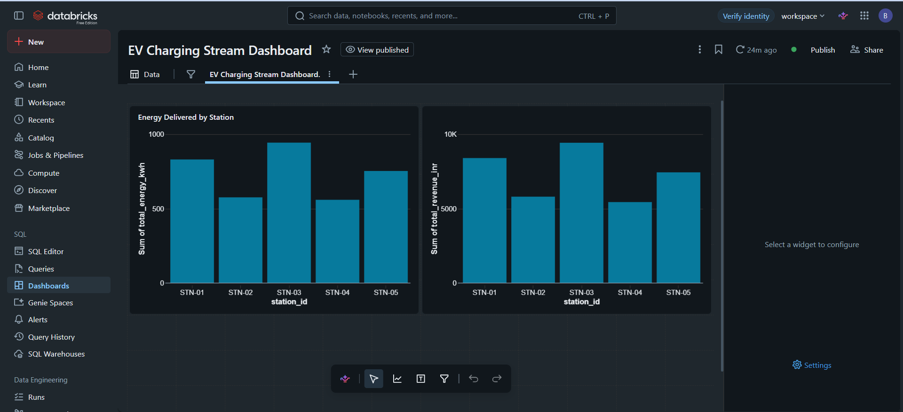
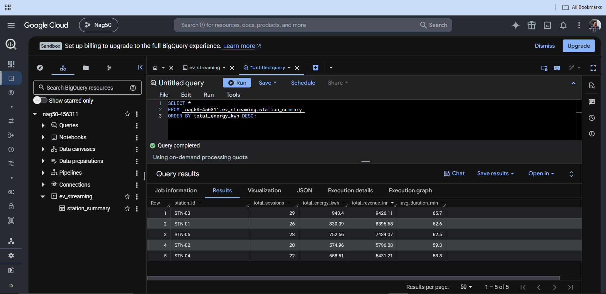

# EV Charging Stream Processing — Real-Time Data Pipeline

A real-time (incremental micro-batch) streaming data pipeline built on **Databricks**, processing simulated EV charging station events with **Spark Structured Streaming** and **Auto Loader**, organized as a **bronze → gold medallion lakehouse**, with aggregated results loaded into **Google BigQuery** for cloud-warehouse querying.

This project demonstrates streaming ingestion, event-time windowing, and cross-cloud data movement — built on the same IoT / EV charging domain as real production telemetry systems.

---

## Architecture

Event simulator → Landing volume (JSON) → Auto Loader → Bronze (Delta) → Windowed aggregation → Gold (Delta) → Dashboard + BigQuery

- **Simulator** → generates EV charging session events as JSON files
- **Auto Loader** → incrementally ingests new files into a bronze Delta table (checkpoint-based, exactly-once)
- **Windowed aggregation** → per-station metrics in 5-minute event-time windows
- **Gold** → business-ready aggregated Delta table
- **Serving** → Databricks dashboard + Google BigQuery

Runs on Databricks serverless with Spark Structured Streaming using the `Trigger.AvailableNow` incremental micro-batch pattern.

---

## Tech Stack

- **Streaming:** Spark Structured Streaming, Auto Loader (cloudFiles)
- **Storage Format:** Delta Lake (checkpoints, exactly-once processing)
- **Platform:** Databricks (Free Edition, serverless)
- **Cloud Warehouse:** Google BigQuery (Sandbox)
- **Modeling Pattern:** Medallion architecture (bronze / gold)
- **Visualization:** Databricks SQL Dashboards
- **Language:** Python, SQL

---

## Pipeline Overview

### 1. Event Simulator (01_event_simulator.ipynb)
Generates batches of EV charging session events (station, city, energy delivered, cost, duration, status) and writes them as JSON files into a landing volume — simulating a live feed from an IoT gateway.

### 2. Streaming Ingestion (02_streaming_bronze.ipynb)
Uses Auto Loader to incrementally stream new JSON files into a bronze Delta table. A checkpoint tracks processed files, giving exactly-once, incremental ingestion — re-runs only pick up new data, never reprocessing old files.

### 3. Windowed Aggregation (03_streaming_gold.ipynb)
Aggregates events into 5-minute event-time windows per station using a watermark to handle late-arriving data, producing gold metrics: sessions, total energy (kWh), total revenue, and average duration.

### 4. Dashboard
A Databricks dashboard on the gold table showing energy delivered and revenue by station.

### 5. BigQuery (GCP)
Aggregated gold data was loaded into a BigQuery dataset and queried in the cloud warehouse, demonstrating cross-cloud data movement.

---

## Key Concepts Demonstrated

- Spark Structured Streaming with Auto Loader
- Incremental, checkpoint-based, exactly-once ingestion
- Trigger.AvailableNow micro-batch pattern (cost-efficient serverless streaming)
- Event-time windowing and watermarks for late data
- Medallion (bronze/gold) lakehouse architecture
- Cross-cloud data movement (Databricks → BigQuery)

---

## Repository Structure

- `01_event_simulator.ipynb` — Generates EV charging events into a landing volume
- `02_streaming_bronze.ipynb` — Auto Loader streaming ingestion → bronze Delta table
- `03_streaming_gold.ipynb` — Windowed aggregation → gold Delta table
- `dashboard.png` — Databricks dashboard screenshot
- `bigquery.png` — BigQuery query result screenshot
- `README.md`

---

## Author

**Nagendra Reddy Bonamukkala**

[GitHub](https://github.com/Nagendra191220) · [LinkedIn](https://www.linkedin.com/in/nagendra-reddy-bonamukkala-5b8805224)
